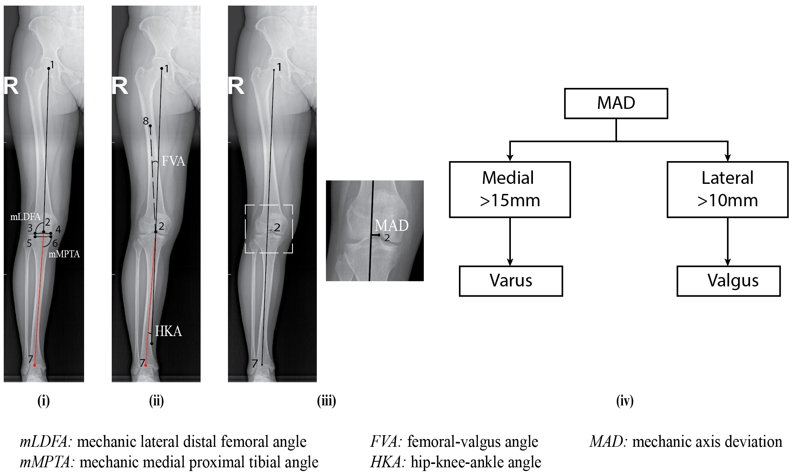
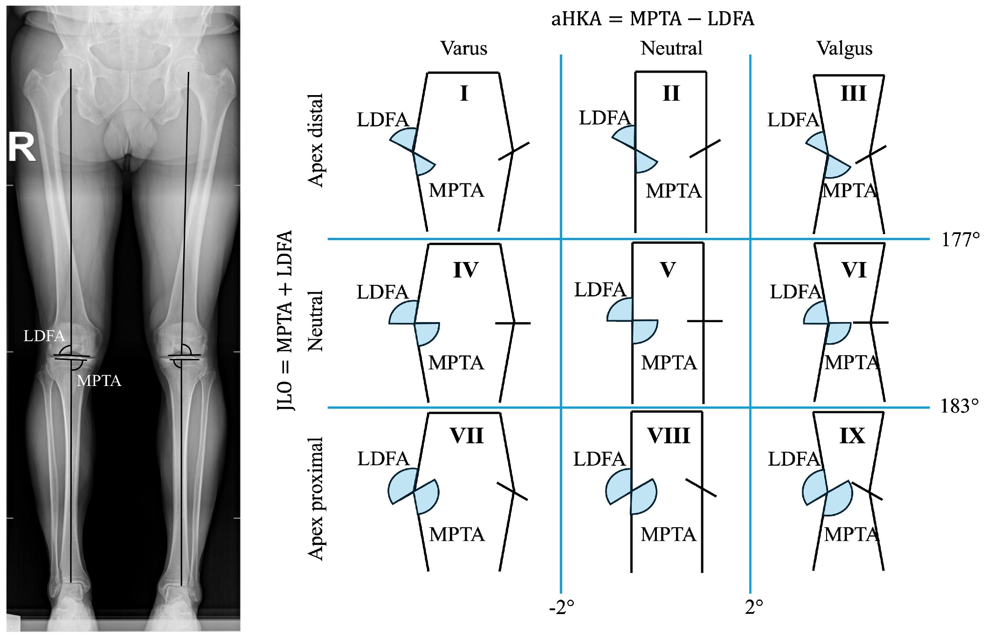
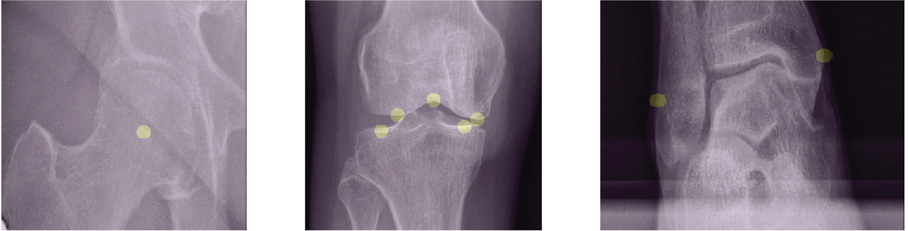
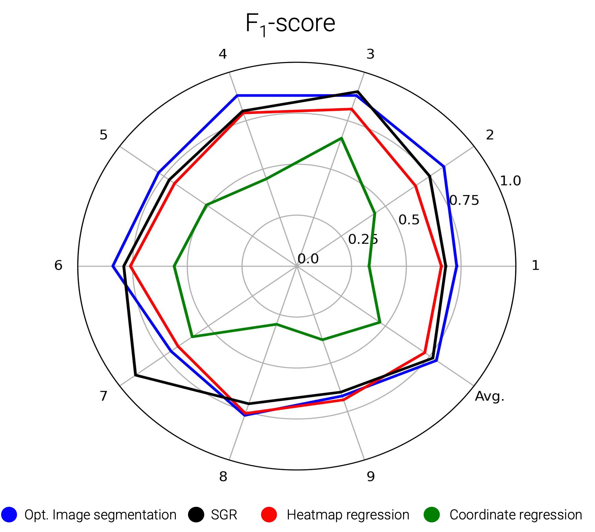
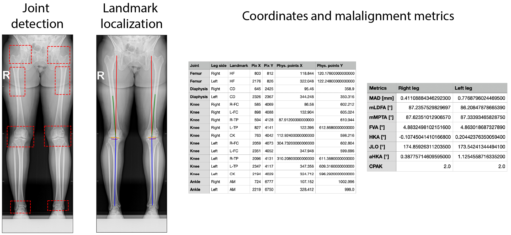
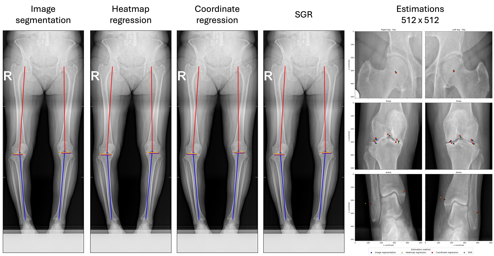

# Anatomical Landmark Segmentation for Reliable Lower-Limb Malalignment Assessment
The goal of this repository is to support research on lower-limb malalignment assessment through automated anatomical 
landmark localization in full lower-limb (FLL) radiographs. It enables users to evaluate the provided pre-trained models 
on their own datasets. Due to third-party data-sharing restrictions, the datasets used for training and evaluation 
cannot be publicly released. However, pre-trained model weights are available (see the [instructions](#ii-download-weights) 
on how to download them). Additionally, the repository includes scripts with documentation describing their usage,
expected inputs, and generated outputs.

⚠️ **Notes:** 
- Active maintenance of this repository is not guaranteed.
- The provided models are intended for **research purposes only** and have not been validated for clinical or commercial 
use.

> **Related sources:**
> - Associated [paper](https://ieeexplore.ieee.org/document/1100857). Detailed description of the methodology and results.
> - Hugging Face [weights](https://huggingface.co/samador7/sgm-lnd-det-v1). Corresponding weights for each model.
> - SGR [repository](https://github.com/ETRO-MIT/LowerLimbMalalignment-SGR). Further information on the SGR pipeline.

---

## Citation
If you use this repository or any of its components (e.g., models, functions, or pipelines), please cite:

```bibtex
@article{sanchez2025optimization,
  title={Optimization and benchmarking of image segmentation for improved landmark detection in lower limb X-rays and accurate coronal plane alignment of the knee classification},
  author={Sanchez, Sebastian Amador and Zarghami, Ashkan and Van Overschelde, Philippe and Vandemeulebroucke, Jef},
  journal={IEEE Access},
  year={2025},
  publisher={IEEE}
}
``` 

---

## Quick start

### Supported Localization Methods

| Method                                    | Keyword        |
|-------------------------------------------|----------------|
| Optimized Image Segmentation              | `Segmentation` |
| Heatmap Regression                        | `Heatmap`      |
| Coordinate Regression                     | `Regression`   |
| Segmentation-Guided Coordinate Regression | `SGR`          |

### Example

```bash
# Clone repository
git clone https://github.com/ETRO-MIT/LowerLimbMalalignment-SGM.git

# Install dependencies
pip install -r requirements.txt

# Download model weights
python DownloadWeights.py

# Run inference
python Main.py Images Segmentation True
```

---

## Introduction

Accurate identification of anatomical landmarks is a fundamental task in medical image analysis. In orthopedic imaging, 
a key application of landmark localization is the assessment of lower-limb malalignment. Clinical evaluation is 
typically performed using full lower-limb (FLL) radiographs, where predefined anatomical landmarks are manually 
annotated. After landmark identification, anatomical and mechanical axes are constructed, from which clinically relevant 
angles are derived allowing quantitative assessment of lower-limb malalignment.



**Figure 1.**  *Left:* Landmarks required for malalignment assessment.  *Right:* Definition of valgus–varus deformity.

Based upon malalignment measurements, the Coronal Plane Alignment of the Knee (CPAK) phenotype classification system was 
introduced. CPAK provides a standardized nomenclature for describing coronal knee alignment in terms of the arithmetic
hip-knee-ankle angle (aHKA) and the joint line obliquity (JLO); see Figure 2.



**Figure 2.**  *Left:* Angles required for CPAK calculation.  *Right:* CPAK classification system.

This repository builds upon the two-stage methodology described in the [Segmentation-Guided Coordinate Regression (SGR)](https://github.com/ETRO-MIT/LowerLimbMalalignment-SGR) 
repository, where landmark localization and malalignment assessment is performed in two main phases. First, a Faster R-CNN 
model detects the hip, knee, and ankle joints. Then, landmark localization is performed using dedicated deep learning 
models, enabling accurate quantification of lower-limb malalignment.

The work described in the associated [paper](https://ieeexplore.ieee.org/document/11008572) focuses on improving landmark
localization through image segmentation by analyzing the impact on landmark localization accuracy of three 
hyperparameters and optimizing them:

1. **Network architecture**
2. **Training mask size**
3. **Method to derive the landmark coordinates from the resultant probability maps**

After optimization of the previous hyperparameters, the resulting optimized image-segmentation approach was compared 
with other commonly used landmark-localization methods: heatmap regression, coordinate regression, and segmentation-guided 
coordinate regression. The comparison was performed in terms of landmark-localization accuracy, malalignment-assessment 
accuracy, and CPAK phenotype-classification performance. Results indicate that the optimized image segmentation approach 
outperforms the other approaches. 

In this repository, the resultant weights of the optimization and benchmarking process are provided. Additionally, the
necessary codes to perform inference on full lower limb radiographs (either in medical or non-medical image formats) are
given in order to validate the performance of the models on independent datasets. 

---

## Methodology & Results
A five-fold cross-validation procedure, further detailed in the main [manuscript](https://ieeexplore.ieee.org/document/11008572),
was performed to search for the optimal configuration that achieved a lower Euclidean distance error in the task of 
identifying a set of 8 different lower limb landmarks: one at the hip region, five on the knee joint, and two at the 
ankle joint; see Figure 3 for more details. 



**Figure 3.**  Example of the target landmarks to be identified on each joint: hip, knee, and ankle, respectively. 

The following parameters were evaluated and optimized:
1. **Network architecture:** 
   - Fully CNN-based U-Net 
   - Swin-UNETR
2. **Training mask size:** 
    - Single pixel 
    - Circular masks of different radii values (7, 15, 30, and 45 px).
3. **Method to derive the landmark coordinates from the resultant probability maps**:
    - Centroid computation
    - Largest component filtering + centroid computation
    - Binary threshold + centroid computation
    - Max. probability computation
    - Adapted threshold + centroid computation

The cross-validation study revealed that optimal performance was achieved (Median Euclidean error (IQR) = 1.21 mm (1.60 mm)) 
using the following parameters:

- Fully CNN-based U-Net
- Circular masks with r=15 px
- Adapted threshold + centroid computation

After optimization, image segmentation was contrasted with other common landmark localization methods: heatmap 
regression, coordinate regression, and segmentation-guided coordinate regression (SGR) in the tasks of malalignment 
assessment and coronal plane alignment of the knee classification tasks. Table 1 and Figure 4 summarize the results
achieved by each localization method on each task.

**Table 1.** CPAK angular accuracy for the different assessed methodologies.

| Method                     | mLDFA [°]        | mMPTA [°]        | aHKA [°]         | JLO [°]          |
|----------------------------|------------------|------------------|------------------|------------------|
| 🔵 Opt. Image segmentation | **0.26 (0.42)†** | **0.41 (0.57)†** | **0.58 (0.74)†** | **0.47 (0.80)†** |
| 🔴 Heatmap regression      | 0.43 (0.50)      | 0.45 (0.68)      | 0.71 (0.98)      | 0.63 (0.88)      |
| ⚫ SGR                      | 0.36 (0.46)      | 0.52 (0.71)      | 0.61 (0.90)      | 0.70 (0.94)      |
| 🟢 Coordinate regression   | 0.98 (1.38)      | 0.97 (1.30)      | 1.36 (1.79)      | 1.48 (1.90)      |

† Statistically significant difference between segmentation and heatmap regression (Wilcoxon test, α = 0.05)



**Figure 4.**  F1-score achieved for each of the different assessed methodologies on the individual CPAK classes and on 
average. 

The achieved results highlight the potential of segmentation-based landmark localization for accurate and robust 
malalignment assessment. Additionally, these findings confirm that by optimizing intrinsic design factors, segmentation 
can achieve high accuracy and reliability without increasing architectural complexity.

---

## Installation
### I. Virtual environment
Tested with **Python 3.9.12**. First, create a virtual environment, then install all the dependencies:

```bash
python3.9 -m venv lnd_sgm_env
source lnd_sgm_env/bin/activate
pip install --upgrade pip setuptools wheel
pip install -r requirements.txt
```

### II. Download weights
Pre-trained weights for all models are available through Hugging Face. Before downloading the weights, refer to the 
weights' [README](https://huggingface.co/samador7/sgm-lnd-det-v1) for additional details. To download the weights use 
the following command:

```bash
python DownloadWeights.py
``` 

### III. Notes
- By default, PyTorch may be installed in CPU-only mode. To enable GPU acceleration, install the appropriate CUDA 
version from: https://pytorch.org/get-started/previous-versions/
- Device selection is handled automatically inside the main inference code through:
```python
import torch
device = torch.device("cuda" if torch.cuda.is_available() else "cpu")
```

---

## Repository Structure

After cloning this repository and downloading the weights from Hugging Face, you will have the following structure:

```
- Detection/      → Functions required to build each of the landmark localization methods 
- Figures/        → Images used in the README
- Functions/      → Utility functions for pre- and post-processing
- Models/         → Model definitions
- Weights/        → Downloaded pre-trained weights
- README.md
- DownloadWeights.py
- LandmarkEstimation.py
- Main.py
- RoiDetection.py
- LICENSE
- requirements.txt
```

### Description
* **`DownloadWeights.py`** — Downloads the weights from the Hugging Face [repository](https://huggingface.co/samador7/sgm-lnd-det-v1).
* **`LandmarkEstimation.py`** — Builds a landmark localization model and estimates the coordinates on a full-leg 
radiograph.
* **`Main.py`** — Executes landmark localization on a given set of images through the desired method: image segmentation,
heatmap regression, coordinate regression, or SGR.
* **`RoiDetection.py`** — Builds a Faster R-CNN model and performs region detection (hip, knee, and ankle joints) in a 
full-leg radiograph.

---

## Usage
### I. Input Data
The pipeline expects full lower-limb radiographs organized in one of the following directory structures:

```
Images/
├── Image1.dcm
├── Image2.dcm
```

or

```
Images/
├── Subject_1/
│   └── subject1.dcm
├── Subject_2/
│   └── subject2.dcm
```

> **Notes** 
> * The images should be frontal full-leg radiographs with both legs completely visible.
> * `DICOM` format is recommended. Standard image formats (`.jpg` and `.png`) are also supported, however, results can 
be suboptimal compared to those achieved using `DICOM`.
> * The models were trained using pre- and post-operative radiographic images; therefore, it is possible to analyze 
cases with orthopedic devices. Nevertheless, a suboptimal performance has been observed in low quality images and those 
containing occluding external devices.

### II. Running the Pipeline

To run inference on a dataset of radiographs, execute:

```bash
python Main.py path_to_images localization_method is_dicom
```
>**Description**
> - `path_to_images`: Complete path to the directory where the images are present
> - `localization_method`: Select between `Segmentation` for image segmentation, `Heatmap` for heatmap regression, 
`Regression` for coordinate regression, and `SGR` for segmentation-guided coordinate regression.
> - `is_dicom`: `True` for `DICOM` images, `False` otherwise (`.jpg` or `.png`).

### III. Output
An `Outputs/` directory will be automatically generated:

```
Outputs/
├── Subject1/
   └── Segmentation
      └── Results with image segmentation
   └── Heatmap
   └── Regression
   └── SGR
├── Subject2/
```

Each subfolder will contain:

1. **`*_boxes.png`** → Detected joint regions.
2. **`*_FLL_Axes.png`** → Overlay of anatomical and mechanical axes.
3. **`*_FLL_coordinates.csv`** → Landmark coordinates (pixel and physical units). ⚠️ For non-DICOM images, physical 
coordinates are identical to pixel coordinates.
4. **`*_Malalignment.csv`**  → Computed metrics for each leg side:
   - Mechanical Axis Deviation (MAD) [mm] | ⚠️ MAD is reported in pixels for non-medical images.
   - Mechanical Lateral Distal Femoral Angle (mLDFA) [deg]
   - Mechanical Medial Proximal Tibial Angle (mMPTA) [deg]
   - Hip-Knee-Ankle angle (HKA) [deg] 
   - Arithmetic HKA (aHKA) [deg]
   - Joint Line Obliquity (JLO) [deg]
   - Coronal Plane Alignment of the Knee (CPAK) class
5. **`*_512px_coordinates.csv`** → Landmark coordinates in the joint 512×512 coordinate system.



**Figure 5.** Example outputs generated by the pipeline.



**Figure 6.** Example comparing the four landmark localization techniques. In addition to the comparisons at the full-leg
radiograph level, the estimations at the 512 x 512 domain are provided for better distinction between the methods.

---

## License

- **Inference code** (`*.py` and related scripts): licensed under the [Apache License 2.0](LICENSE).
- **Model weights** (`*.pth`): licensed under the [Creative Commons Attribution Non Commercial Share Alike 4.0](https://creativecommons.org/licenses/by-nc-sa/4.0/).

Users of this repository must comply with both licenses, depending on the component being used.
